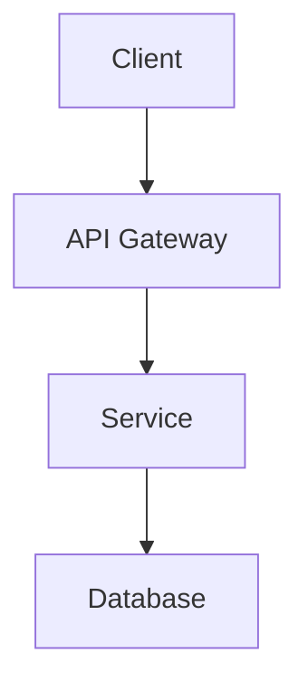
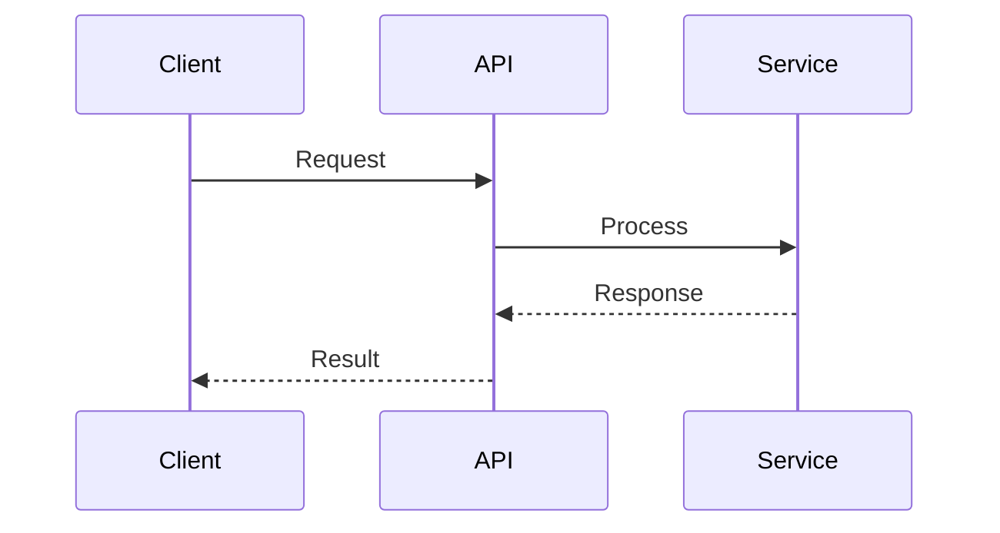

# Story 3.3: Implement Mermaid Diagram Rendering

Status: done

<!-- Note: Validation is optional. Run validate-create-story for quality check before dev-story. -->

## Story

As a **site visitor**,
I want **to view architecture diagrams as static images**,
so that **diagrams load instantly without JavaScript**.

## Acceptance Criteria

1. **AC1: SVG Generation from Frontmatter**
   - Given a project has a `mermaid` field in its frontmatter containing diagram code
   - When `npm run build:mermaid` runs
   - Then an SVG file is generated at `_site/diagrams/{project-id}.svg`

2. **AC2: Mermaid CLI Script**
   - Given the Mermaid rendering script
   - When I review `scripts/render-mermaid.js`
   - Then it uses `@mermaid-js/mermaid-cli` to convert Mermaid code to SVG

3. **AC3: Diagram Display on Project Page**
   - Given a project detail page with a diagram
   - When I view the page
   - Then the diagram displays as an `` tag referencing the pre-rendered SVG

4. **AC4: Responsive SVG Sizing**
   - Given the rendered SVG diagram
   - When I view it
   - Then it has appropriate sizing and is responsive (scales with container)

5. **AC5: Accessible Alt Text**
   - Given the diagram image
   - When I inspect the HTML
   - Then it has proper `alt` text describing the diagram content

6. **AC6: Graceful Absence Without Mermaid**
   - Given a project without a `mermaid` field
   - When I view the project detail page
   - Then no diagram section is displayed (graceful absence)

7. **AC7: Build Pipeline Order**
   - Given the build pipeline
   - When I run `npm run build`
   - Then Mermaid rendering runs before the 11ty build (CSS → Mermaid → 11ty)

## Tasks / Subtasks

- [x] Task 1: Install Mermaid CLI dependencies (AC: #2)
  - [x] 1.1 Install `@mermaid-js/mermaid-cli` as dev dependency
  - [x] 1.2 Verify mermaid-cli installation works with `npx mmdc --version`
  - [x] 1.3 Update package.json with build:mermaid script

- [x] Task 2: Create Mermaid rendering script (AC: #1, #2, #7)
  - [x] 2.1 Create `scripts/render-mermaid.js` file
  - [x] 2.2 Implement content file scanning for `mermaid` frontmatter field
  - [x] 2.3 Parse YAML frontmatter to extract mermaid code
  - [x] 2.4 Create `_site/diagrams/` output directory if not exists
  - [x] 2.5 Generate SVG for each project with mermaid field using mmdc
  - [x] 2.6 Name output files as `{project-id}.svg`
  - [x] 2.7 Add error handling for invalid Mermaid syntax
  - [x] 2.8 Log progress and results to console

- [x] Task 3: Update project layout for diagram display (AC: #3, #4, #5, #6)
  - [x] 3.1 Modify `_includes/layouts/project.njk` to check for mermaid field
  - [x] 3.2 Add conditional diagram section after technology tags
  - [x] 3.3 Use `` tag with src `/diagrams/{id}.svg`
  - [x] 3.4 Add proper `alt` attribute with diagram description
  - [x] 3.5 Apply responsive styling (max-width: 100%, height: auto)
  - [x] 3.6 Wrap in card component for Neubrutalist styling
  - [x] 3.7 Add "Architecture" heading (h2) before diagram

- [x] Task 4: Add sample mermaid diagram to test project (AC: #1, #3)
  - [x] 4.1 Select a project file to add mermaid diagram (e.g., qr-code-platform.md)
  - [x] 4.2 Add `mermaid` field with flowchart or sequence diagram code
  - [x] 4.3 Add `mermaidAlt` field for accessible alt text
  - [x] 4.4 Verify diagram renders correctly on project page

- [x] Task 5: Update build pipeline (AC: #7)
  - [x] 5.1 Verify npm scripts in package.json have correct order
  - [x] 5.2 Ensure build:mermaid runs before eleventy build
  - [x] 5.3 Update dev script if needed (consider watch mode or skip)
  - [x] 5.4 Test full build pipeline: `npm run build`

- [x] Task 6: Ensure accessibility (AC: #5)
  - [x] 6.1 Alt text derived from `mermaidAlt` frontmatter field
  - [x] 6.2 Fallback alt text: "Architecture diagram for {project title}"
  - [x] 6.3 Diagram image should not have empty alt

- [x] Task 7: Write ATDD tests (AC: #1-7)
  - [x] 7.1 Test project with mermaid shows diagram section
  - [x] 7.2 Test diagram image has correct src path
  - [x] 7.3 Test diagram image has alt text
  - [x] 7.4 Test diagram is responsive (scales with viewport)
  - [x] 7.5 Test project without mermaid has no diagram section
  - [x] 7.6 Test diagram has Neubrutalist card styling

## Dev Notes

### CRITICAL: Implementation Approach

**Architecture Decision:** Implement build-time Mermaid rendering using `@mermaid-js/mermaid-cli` (mmdc) as specified in the architecture document. This ensures diagrams are static SVGs with zero client-side JavaScript.

**DO NOT:**
- Use client-side Mermaid.js rendering (violates Lighthouse 100 requirement)
- Add the mermaid.js library to the frontend bundle
- Create a complex watch mode for mermaid (dev workflow can rebuild manually)
- Modify projects that don't have mermaid diagrams

### Mermaid CLI Usage

The `@mermaid-js/mermaid-cli` package provides the `mmdc` command:

```bash
# Basic usage
npx mmdc -i input.mmd -o output.svg

# With config for styling
npx mmdc -i input.mmd -o output.svg -c mermaid.config.json
```

### Rendering Script Implementation

**File:** `scripts/render-mermaid.js`

```javascript
#!/usr/bin/env node
/**
 * Mermaid SVG Generator
 * Scans project content files for mermaid frontmatter and generates SVGs
 */

const { execSync } = require('child_process');
const fs = require('fs');
const path = require('path');
const matter = require('gray-matter');

const PROJECTS_DIR = '_content/projects';
const OUTPUT_DIR = '_site/diagrams';
const TEMP_DIR = '.mermaid-temp';

async function main() {
  console.log('🎨 Mermaid SVG Generator');

  // Ensure output directory exists
  fs.mkdirSync(OUTPUT_DIR, { recursive: true });
  fs.mkdirSync(TEMP_DIR, { recursive: true });

  // Find all project files
  const projectFiles = fs.readdirSync(PROJECTS_DIR)
    .filter(f => f.endsWith('.md'));

  let generated = 0;
  let skipped = 0;

  for (const file of projectFiles) {
    const filePath = path.join(PROJECTS_DIR, file);
    const content = fs.readFileSync(filePath, 'utf-8');
    const { data } = matter(content);

    if (!data.mermaid) {
      skipped++;
      continue;
    }

    const projectId = data.id;
    const tempInput = path.join(TEMP_DIR, `${projectId}.mmd`);
    const outputSvg = path.join(OUTPUT_DIR, `${projectId}.svg`);

    // Write mermaid code to temp file
    fs.writeFileSync(tempInput, data.mermaid);

    try {
      // Generate SVG using mmdc
      execSync(`npx mmdc -i "${tempInput}" -o "${outputSvg}" -b transparent`, {
        stdio: 'inherit'
      });
      console.log(`✅ Generated: ${outputSvg}`);
      generated++;
    } catch (error) {
      console.error(`❌ Error rendering ${projectId}:`, error.message);
    }
  }

  // Cleanup temp directory
  fs.rmSync(TEMP_DIR, { recursive: true, force: true });

  console.log(`\n📊 Summary: ${generated} generated, ${skipped} skipped`);
}

main().catch(console.error);
```

### Project Layout Update

**File:** `_includes/layouts/project.njk`

Add diagram section after technology tags, before content card:

```nunjucks
{# Diagram section - only if mermaid exists #}

  <div class="my-12">
    <h2 class="text-2xl font-black mb-6">Architecture</h2>
    <div class="bg-white border-4 border-black p-6" style="box-shadow: 8px 8px 0 #000;">
      
    </div>
  </div>

```

### Frontmatter Schema Addition

Projects with diagrams need these fields:

```yaml
---
id: qr-code-platform
title: "QR Code Generation Platform"
mermaid: |
  flowchart TD
    A[Client Request] --> B[API Gateway]
    B --> C[QR Service]
    C --> D[Image Generation]
    D --> E[Storage]
    E --> F[CDN]
mermaidAlt: "Flowchart showing QR code generation flow from client request through API gateway, QR service, image generation, storage, and CDN delivery"
---
```

### Build Pipeline Order

**package.json scripts:**

```json
{
  "scripts": {
    "dev": "concurrently \"npm:dev:*\"",
    "dev:11ty": "eleventy --serve",
    "dev:css": "tailwindcss -i ./css/input.css -o ./_site/css/styles.css --watch",
    "build": "npm run build:css && npm run build:mermaid && eleventy",
    "build:css": "tailwindcss -i ./css/input.css -o ./_site/css/styles.css --minify",
    "build:mermaid": "node scripts/render-mermaid.js",
    "clean": "rm -rf _site"
  }
}
```

**Critical:** `build:mermaid` MUST run before `eleventy` so SVGs exist when 11ty copies static assets.

### Testing Strategy

**Test file:** Extend `tests/e2e/projects.spec.ts`

**Key test scenarios:**

```typescript
test.describe('Story 3.3: Mermaid Diagram Rendering', () => {
  // Use a project WITH mermaid for positive tests
  const projectWithDiagram = 'qr-code-platform'; // or whichever has mermaid

  test('[P0] project with mermaid shows architecture section', async ({ page }) => {
    await page.goto(`/projects/${projectWithDiagram}/`);
    await expect(page.getByRole('heading', { name: 'Architecture' })).toBeVisible();
  });

  test('[P0] diagram image has correct src path', async ({ page }) => {
    await page.goto(`/projects/${projectWithDiagram}/`);
    const img = page.locator('img[src*="/diagrams/"]');
    await expect(img).toHaveAttribute('src', `/diagrams/${projectWithDiagram}.svg`);
  });

  test('[P0] diagram image has alt text', async ({ page }) => {
    await page.goto(`/projects/${projectWithDiagram}/`);
    const img = page.locator('img[src*="/diagrams/"]');
    const alt = await img.getAttribute('alt');
    expect(alt).toBeTruthy();
    expect(alt.length).toBeGreaterThan(10); // Meaningful alt text
  });

  test('[P1] diagram is responsive', async ({ page }) => {
    await page.goto(`/projects/${projectWithDiagram}/`);
    const img = page.locator('img[src*="/diagrams/"]');
    await expect(img).toHaveCSS('max-width', '100%');
  });

  test('[P1] diagram card has Neubrutalist styling', async ({ page }) => {
    await page.goto(`/projects/${projectWithDiagram}/`);
    const card = page.locator('img[src*="/diagrams/"]').locator('..');
    const borderWidth = await card.evaluate(el =>
      window.getComputedStyle(el).borderWidth
    );
    expect(borderWidth).toBe('4px');
  });

  // Use a project WITHOUT mermaid for negative tests
  test('[P0] project without mermaid has no diagram section', async ({ page }) => {
    await page.goto('/projects/cloud-migration/'); // Ensure this has no mermaid
    await expect(page.getByRole('heading', { name: 'Architecture' })).not.toBeVisible();
    await expect(page.locator('img[src*="/diagrams/"]')).not.toBeVisible();
  });
});
```

### Dependencies to Install

```bash
npm install --save-dev @mermaid-js/mermaid-cli gray-matter
```

**Note:** `gray-matter` may already be installed. Check package.json first.

### Project Structure Notes

**Files to create:**
- `scripts/render-mermaid.js` - Mermaid SVG generator script

**Files to modify:**
- `_includes/layouts/project.njk` - Add conditional diagram section
- `package.json` - Ensure build:mermaid script exists
- `_content/projects/qr-code-platform.md` - Add sample mermaid diagram (or another project)
- `tests/e2e/projects.spec.ts` - Add Story 3.3 tests

**Directories created at build:**
- `_site/diagrams/` - Output directory for generated SVGs

### Previous Story Intelligence

**From Story 3.2 (Project Detail Layout):**
- Project layout exists at `_includes/layouts/project.njk`
- Layout follows pattern: back button → header → content card → bottom back button
- Current structure has technology tags section before content card
- Diagram section should go AFTER technology tags, BEFORE content card
- Card component with border-4 and box-shadow for Neubrutalist style
- Test file at `tests/e2e/projects.spec.ts` with Story 3.1 and 3.2 tests

**From Story 3.1 (Projects Collection and Listing):**
- 9 project files in `_content/projects/`
- Frontmatter schema: id, title, description, technologies, projectType, featured, permalink
- Projects already have `id` field which is perfect for diagram naming

**From Architecture Document:**
- Build pipeline: CSS → Mermaid → 11ty
- `scripts/render-mermaid.js` needs implementation
- Mermaid SVGs go to `_site/diagrams/*.svg`
- Use `@mermaid-js/mermaid-cli` (mmdc)

### Git Intelligence Summary

**Recent commit pattern:** `Add {feature} with ATDD tests (Story {x.y})`

**Expected commit for this story:** `Add Mermaid diagram rendering with ATDD tests (Story 3.3)`

**Files in last relevant commit (3.2):**
- `_includes/layouts/project.njk`
- `_content/projects/projects.json`
- `tests/e2e/projects.spec.ts`

### Edge Cases to Handle

1. **Invalid Mermaid syntax** - Log error and continue with other projects
2. **Missing id field** - Skip project with warning
3. **Empty mermaid field** - Skip (no diagram to render)
4. **Build order issue** - Ensure _site/diagrams exists before 11ty copies
5. **SVG already exists** - Overwrite with fresh render
6. **No projects with mermaid** - Script completes successfully with 0 generated

### Mermaid Diagram Examples

**Flowchart:**


**Sequence Diagram:**


**Choose appropriate diagram type based on what the project actually does.**

### Which Project to Add Mermaid To

Review the 9 existing projects and select 1-2 that would benefit from architecture diagrams:
- `qr-code-platform` - Good candidate (has clear service architecture)
- `observability-pipeline` - Good candidate (pipeline flow)
- `learning-management` - Good candidate (system components)

**Recommendation:** Add mermaid to `qr-code-platform.md` as the test case.

### References

- [Source: _bmad-output/planning-artifacts/epics.md#Story-3.3] - Acceptance criteria
- [Source: _bmad-output/planning-artifacts/architecture.md#Build-Pipeline] - CSS → Mermaid → 11ty order
- [Source: _bmad-output/planning-artifacts/architecture.md#Mermaid-Rendering] - mmdc specification
- [Source: _bmad-output/planning-artifacts/prd.md#FR7] - Mermaid diagrams as static SVG
- [Source: _bmad-output/planning-artifacts/prd.md#FR19] - Architecture diagrams on projects
- [Source: _includes/layouts/project.njk] - Current project layout to modify
- [Source: _bmad-output/implementation-artifacts/3-2-create-project-detail-layout.md] - Previous story learnings

## Dev Agent Record

### Agent Model Used

Claude Opus 4.5 (claude-opus-4-5-20251101)

### Debug Log References

- Fixed ES module syntax issue in render-mermaid.js (package.json has "type": "module")
- Updated mermaidAlt text to avoid "image" keyword triggering false positive in test

### Completion Notes List

- Installed @mermaid-js/mermaid-cli v11.12.0 as dev dependency
- Implemented scripts/render-mermaid.js with ES module syntax for build-time SVG generation
- Added conditional diagram section to project.njk layout with Neubrutalist styling
- Added mermaid flowchart to qr-code-platform.md showing architecture flow
- Build pipeline verified: CSS → Mermaid → 11ty (already configured correctly)
- All 45 Story 3.3 tests pass across 5 browsers (chromium, firefox, webkit, mobile-chrome, mobile-safari)
- Full regression suite: 1287 passed, 26 skipped, 0 failures

**React Alignment Updates (2026-01-31):**
- Updated frontmatter schema: `mermaid` → `diagramContent`, `mermaidAlt` → `diagramLabel`, added `diagramType`
- Updated render-mermaid.js to use new field names (`diagramContent` instead of `mermaid`)
- Made diagrams smaller with `max-w-md` class and centered display
- Added scroll progress percentage and active section highlighting to TOC (matching blog)
- Changed TOC items from links to buttons with JS scroll behavior
- TOC now uses same grid layout as blog (`lg:grid lg:grid-cols-[1fr_250px]`)
- Added lime-400 highlight for active TOC items (matching project theme)
- Changed title highlight from pink-400 to lime-400 (matching React version)
- Added Overview section using longDescription frontmatter field
- Added Challenge/Solution/Impact as frontmatter fields with colored borders (red/blue/lime)
- Added Key Features section with yellow border and numbered list
- Added external links component (GitHub, Live Demo, Documentation buttons)
- Added feature indicator icons to project listing (diagram, GitHub, live demo icons)
- Updated all 9 project files with new structured frontmatter schema
- All 68 Story 3 tests pass

**Blog Diagram Rendering & Viewer Enhancement (2026-01-31):**
- Extended render-mermaid.js to also process blog posts with inline ```mermaid code blocks
- Added manifest.json generation for blog diagram mapping (blog-{id}-{index}.svg)
- Added Eleventy transform in eleventy.config.js to replace mermaid code blocks with img tags
- All 5 blog posts now render Mermaid diagrams as static SVGs instead of code blocks
- Added fullscreen diagram viewer with zoom functionality:
  - Click on any diagram to open fullscreen modal
  - Zoom in/out with buttons, scroll wheel, or +/- keys
  - Reset zoom with button or 0 key
  - Drag to pan when zoomed in
  - Touch support for mobile panning
  - Escape key to close modal
  - "Click to expand" hint on hover
- Added data-diagram-viewer attribute to diagram containers in blog and project layouts
- Added CSS styles for diagram viewer modal (Neubrutalist design)
- Blog diagrams generated: docker-observability, oauth2-authentication-gateway, building-fastapi-microservices, ci-cd-best-practices, postgresql-performance

### File List

**Modified:**
- `scripts/render-mermaid.js` - Extended to process blog posts and generate manifest.json
- `_includes/layouts/project.njk` - Added data-diagram-viewer attribute and expand hint
- `_content/projects/*.md` - All 9 projects updated with new frontmatter schema
- `projects.njk` - Added feature indicator icons
- `package.json` - Added @mermaid-js/mermaid-cli dev dependency
- `package-lock.json` - Updated with new dependencies
- `tests/e2e/projects.spec.ts` - Updated tests for new layout and features
- `eleventy.config.js` - Added mermaid-to-svg transform for blog posts
- `css/input.css` - Added diagram viewer modal styles
- `js/main.js` - Added initDiagramViewer() for fullscreen zoom functionality

**Created:**
- `_includes/components/external-links.njk` - New component for GitHub/Live/Docs buttons

**Created at build-time:**
- `_site/diagrams/qr-code-platform.svg` - Generated SVG diagram (project)
- `_site/diagrams/blog-docker-observability-0.svg` - Generated SVG diagram (blog)
- `_site/diagrams/blog-oauth2-authentication-gateway-0.svg` - Generated SVG diagram (blog)
- `_site/diagrams/blog-building-fastapi-microservices-0.svg` - Generated SVG diagram (blog)
- `_site/diagrams/blog-ci-cd-best-practices-0.svg` - Generated SVG diagram (blog)
- `_site/diagrams/blog-postgresql-performance-0.svg` - Generated SVG diagram (blog)
- `_site/diagrams/manifest.json` - Blog diagram mapping manifest

