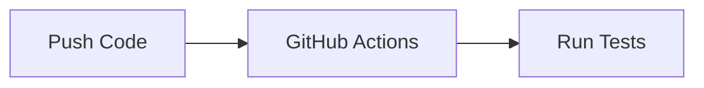

# Content Schema Reference

**Generated:** 2026-02-01
**Project:** jaysingh.dev
**Framework:** 11ty + Nunjucks
**Status:** Migration Complete

---

## Overview

Content is authored in Markdown with YAML frontmatter. 11ty processes these files directly using its data cascade and collection system. Frontmatter is validated at build time via custom validators in `lib/filters.js`.

---

## Blog Post Schema

**Location:** `_content/blog/*.md`
**Collection:** `posts`
**Layout:** `layouts/blog-post.njk`
**Validation:** `validateBlogPost()` in `lib/filters.js`

### Frontmatter Fields

| Field | Type | Required | Description |
|-------|------|----------|-------------|
| `id` | string | ✓ | Unique identifier (URL slug) |
| `title` | string | ✓ | Post title |
| `date` | date | ✓ | Publication date (YYYY-MM-DD) |
| `excerpt` | string | ✓ | Short description for previews |
| `tags` | string[] | ✓ | Technology/category tags (min 1) |
| `readTime` | string | ✓ | Estimated read time (e.g., "9 min") |
| `featured` | boolean | | Show on homepage (default: false) |
| `relatedProjectIds` | string[] | | IDs of related projects |
| `author` | object | | Author information |
| `lastUpdated` | date | | Last update date |
| `permalink` | string | ✓ | URL path (e.g., `/blog/post-slug/`) |
| `layout` | string | ✓ | Layout template path |

### Example

```yaml
---
id: ci-cd-best-practices
title: CI/CD BEST PRACTICES WITH GITHUB ACTIONS
date: 2024-07-18
excerpt: Building reliable deployment pipelines with automated testing.
tags:
  - cicd
  - github-actions
  - devops
  - technical
readTime: 9 min
featured: true
relatedProjectIds:
  - cicd-pipeline
permalink: /blog/ci-cd-best-practices/
layout: layouts/blog-post.njk
---

Content with Mermaid diagrams, code blocks, etc.
```

### Inline Mermaid Diagrams

Blog posts can include inline Mermaid diagrams using fenced code blocks:

````markdown

````

These are converted to pre-rendered SVGs at build time by `scripts/render-mermaid.js`.

### Nunjucks Escaping

For GitHub Actions syntax in code blocks, use `...`:

```yaml
username: ${{ github.actor }}
```

---

## Project Schema

**Location:** `_content/projects/*.md`
**Collection:** `projects`
**Layout:** `layouts/project.njk`
**Validation:** `validateProject()` in `lib/filters.js`

### Frontmatter Fields

| Field | Type | Required | Description |
|-------|------|----------|-------------|
| `id` | string | ✓ | Unique identifier |
| `title` | string | ✓ | Project title |
| `description` | string | ✓ | Short description for cards |
| `projectType` | enum | ✓ | `work` or `personal` |
| `technologies` | string[] | ✓* | Technology tags |
| `tags` | string[] | ✓* | Alternative to technologies |
| `featured` | boolean | | Show on homepage |
| `permalink` | string | ✓ | URL path |
| `longDescription` | string | | Extended overview |
| `challenge` | string | | Problem statement |
| `solution` | string | | How problem was solved |
| `impact` | string | | Results and metrics |
| `keyFeatures` | string[] | | Feature list |
| `githubUrl` | URL | | GitHub repository |
| `liveUrl` | URL | | Live demo |
| `documentationUrl` | URL | | External docs |
| `diagramType` | string | | `mermaid` (future: `image`) |
| `diagramContent` | string | | Mermaid code for diagram |
| `diagramLabel` | string | | Caption for diagram |

*Either `technologies` or `tags` is required.

### Example

```yaml
---
id: authentication-gateway
title: "Zero-Trust Authentication Gateway"
description: "Distributed authentication gateway serving 5,181+ users."
longDescription: "Enterprise-grade authentication implementing zero-trust..."
technologies:
  - OAuth2-Proxy
  - Traefik
  - Keycloak
  - Docker
projectType: work
featured: true
permalink: /projects/authentication-gateway/
challenge: "The university's legacy authentication was fragmented..."
solution: "Designed a distributed gateway architecture..."
impact: "Successfully secured 5,181+ active user accounts..."
keyFeatures:
  - "Zero-trust architecture"
  - "Granular RBAC policies"
  - "Seamless SSO integration"
githubUrl: "https://github.com/example/auth-gateway"
---
```

### Frontmatter Diagrams

Projects with `diagramContent` in frontmatter are processed by `scripts/render-mermaid.js` to generate SVGs at `/diagrams/{id}.svg`.

---

## Data Files

**Location:** `_data/*.json`
**Access:** Global data available in all templates

### site.json

Site-wide metadata for SEO and branding.

```json
{
  "title": "Jay Singh - Software Engineer",
  "shortTitle": "Jay Singh",
  "description": "Personal portfolio and technical blog...",
  "baseUrl": "https://jaysingh.dev",
  "author": "Jay Singh",
  "language": "en",
  "themeColor": "#bef264",
  "socialImage": "/images/og-default.svg"
}
```

**Usage:** `{{ site.title }}`, `{{ site.baseUrl }}`

### profile.json

Author profile information.

```json
{
  "name": "Jay Singh",
  "role": "Software Engineer",
  "bio": "Full-stack developer specializing in...",
  "location": "New Jersey, USA",
  "socialLinks": {
    "github": "https://github.com/jaysingh",
    "linkedin": "https://linkedin.com/in/jaysingh",
    "email": "mailto:jay@jaysingh.dev"
  }
}
```

**Usage:** `{{ profile.name }}`, `{{ profile.socialLinks.github }}`

### resume.json

Work experience and education.

```json
{
  "experience": [
    {
      "id": "exp-1",
      "company": "HUDSON COUNTY COMMUNITY COLLEGE",
      "position": "WEB DEVELOPER",
      "location": "JERSEY CITY, NJ",
      "startDate": "2023-07",
      "endDate": null,
      "current": true,
      "responsibilities": [...]
    }
  ],
  "education": [
    {
      "id": "edu-1",
      "institution": "NEW JERSEY INSTITUTE OF TECHNOLOGY",
      "degree": "BS IN INFORMATION TECHNOLOGY",
      "location": "NEWARK, NJ",
      "startDate": "2022-09",
      "endDate": "2026-05",
      "gpa": "3.63",
      "details": "Expected graduation May 2026..."
    }
  ],
  "certifications": []
}
```

**Usage:** `...`

### skills.json

Technical skills by category.

```json
{
  "languages": ["Python", "JavaScript", "TypeScript", ...],
  "frameworks": ["FastAPI", "React", "11ty", ...],
  "databases": ["PostgreSQL", "Redis", ...],
  "devops": ["Docker", "GitHub Actions", ...]
}
```

**Usage:** `...`

---

## 11ty Collections

### posts

All blog posts from `_content/blog/*.md`.

```javascript
eleventyConfig.addCollection("posts", collection => {
  return collection.getFilteredByGlob("_content/blog/*.md");
});
```

**Includes validation:** Build fails if frontmatter is invalid.

### projects

All projects from `_content/projects/*.md`.

```javascript
eleventyConfig.addCollection("projects", collection => {
  return collection.getFilteredByGlob("_content/projects/*.md");
});
```

**Includes validation:** Build fails if frontmatter is invalid.

---

## Custom Filters

### readingTime

Calculate estimated read time from HTML content.

```nunjucks
{{ content | readingTime }}  {# "5 min read" #}
```

### findProjectsByIds

Lookup projects by ID array for related projects.

```nunjucks

```

### date

Format dates with UTC handling.

```nunjucks
{{ date | date }}           {# "Jan 15, 2026" #}
{{ date | date('%Y-%m-%d') }}  {# "2026-01-15" #}
{{ date | date('%B %d, %Y') }}  {# "January 15, 2026" #}
```

### getCategoryFromTags

Extract category from tags array.

```nunjucks
{{ tags | getCategoryFromTags }}  {# "TECHNICAL" #}
```

### where / take

Filter and limit arrays.

```nunjucks

```

---

## Validation Rules

### Blog Posts (validateBlogPost)

| Field | Rule |
|-------|------|
| `id` | Required, non-empty string |
| `title` | Required, non-empty string |
| `date` | Required, valid date (Date object or YYYY-MM-DD) |
| `excerpt` | Required, non-empty string |
| `tags` | Required, array with min 1 item |
| `readTime` | Required, non-empty string |

### Projects (validateProject)

| Field | Rule |
|-------|------|
| `id` | Required, non-empty string |
| `title` | Required, non-empty string |
| `description` | Required, non-empty string |
| `projectType` | Required, `work` or `personal` |
| `technologies` or `tags` | At least one required, array with min 1 item |
| `githubUrl`, `liveUrl` | If present, must be valid URL |

---

*Generated by BMAD document-project workflow*
