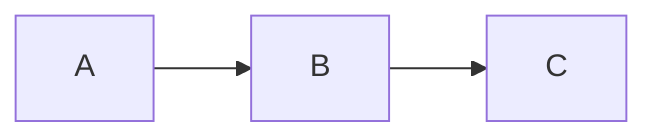

# Development Guide

**Generated:** 2026-02-01
**Project:** jaysingh.dev
**Framework:** 11ty + Nunjucks

---

## Prerequisites

| Requirement | Version | Notes |
|-------------|---------|-------|
| Node.js | >=24.0.0 | LTS version, enforced in package.json |
| npm | 10+ | Comes with Node.js 24 |
| Git | 2.x | Version control |

Check Node.js version:
```bash
node --version  # Should be v24.x.x
```

---

## Quick Start

```bash
# Clone repository
git clone https://github.com/gsinghjay/jaysingh.dev.git
cd jaysingh.dev

# Install dependencies
npm install

# Start development server
npm run dev
```

The development server runs at `http://localhost:8080` with hot reload.

---

## NPM Scripts

### Development

| Script | Command | Description |
|--------|---------|-------------|
| `start` | `npm run dev` | Alias for dev |
| `dev` | `concurrently "npm:dev:11ty" "npm:dev:css"` | Dev server + CSS watch |
| `dev:11ty` | `eleventy --serve` | 11ty with hot reload |
| `dev:css` | `tailwindcss -i ./css/input.css -o ./_site/css/styles.css --watch` | Tailwind watch |

### Build

| Script | Command | Description |
|--------|---------|-------------|
| `build` | `build:css && build:mermaid && eleventy` | Full production build |
| `build:css` | `tailwindcss ... --minify` | Minified CSS |
| `build:mermaid` | `node scripts/render-mermaid.js` | Pre-render Mermaid diagrams |
| `clean` | `rm -rf _site` | Remove build output |

### Testing

| Script | Command | Description |
|--------|---------|-------------|
| `test:e2e` | `playwright test` | Run E2E tests |
| `test:e2e:ui` | `playwright test --ui` | Playwright UI mode |
| `test:e2e:headed` | `playwright test --headed` | See browser |
| `test:e2e:debug` | `playwright test --debug` | Debug mode |
| `test:unit` | `vitest run tests/unit` | Unit tests |
| `test:unit:watch` | `vitest tests/unit` | Unit tests watch |

### Quality

| Script | Command | Description |
|--------|---------|-------------|
| `lint` | `eslint .` | JavaScript linting |
| `typecheck` | `tsc --noEmit -p tsconfig.app.json` | TypeScript check |

---

## Development Workflow

### 1. Content Changes

Edit files in `_content/`:

```bash
# Create/edit a blog post
vim _content/blog/my-new-post.md

# Create/edit a project
vim _content/projects/my-project.md
```

11ty automatically rebuilds on save. No manual rebuild needed.

### 2. Template Changes

Edit files in `_includes/`:

```bash
# Edit a layout
vim _includes/layouts/blog-post.njk

# Edit a component macro
vim _includes/components/card.njk

# Edit a partial
vim _includes/partials/header.njk
```

11ty hot reloads automatically.

### 3. Style Changes

Edit `css/input.css` for global styles:

```bash
vim css/input.css
```

TailwindCSS recompiles automatically in dev mode.

### 4. Data Changes

Edit files in `_data/`:

```bash
# Site metadata
vim _data/site.json

# Author profile
vim _data/profile.json

# Resume data
vim _data/resume.json

# Skills
vim _data/skills.json
```

11ty rebuilds automatically.

---

## Adding Content

### New Blog Post

1. Create file: `_content/blog/my-post.md`
2. Add required frontmatter:

```yaml
---
id: my-post
title: My Post Title
date: 2026-02-01
excerpt: Short description for previews.
tags:
  - tag1
  - tag2
  - technical
readTime: 5 min
permalink: /blog/my-post/
layout: layouts/blog-post.njk
---

Your markdown content here...

## Section Heading

More content with code blocks:

```python
def hello():
    print("Hello, world!")
```

And Mermaid diagrams:


```

### New Project

1. Create file: `_content/projects/my-project.md`
2. Add required frontmatter:

```yaml
---
id: my-project
title: My Project Title
description: Short description for cards.
technologies:
  - Python
  - FastAPI
  - Docker
projectType: personal  # or 'work'
permalink: /projects/my-project/
featured: false
challenge: "The problem being solved..."
solution: "How we solved it..."
impact: "Results achieved..."
keyFeatures:
  - "Feature 1"
  - "Feature 2"
githubUrl: "https://github.com/..."
---
```

### Adding Mermaid Diagrams

For projects with architecture diagrams, add `diagramContent`:

```yaml
diagramType: mermaid
diagramLabel: System Architecture
diagramContent: |
  graph TB
      A[Client] --> B[API Gateway]
      B --> C[Service]
```

Run `npm run build:mermaid` to generate SVG, or it runs automatically during `npm run build`.

---

## Project Configuration

### 11ty (eleventy.config.js)

Key configuration:
- Collections: `posts`, `projects`
- Custom filters: `readingTime`, `date`, `findProjectsByIds`, etc.
- Transforms: `mermaid-to-svg` (replaces code blocks with SVGs)
- Ignores: `_bmad*`, `src/`, `content/`, `node_modules/`

### TailwindCSS (tailwind.config.js)

Custom design tokens:
- Color: `cream: #FFFBEB`
- Shadows: `brutal-sm`, `brutal`, `brutal-md`, `brutal-lg`
- Border radius: All set to 0

Content sources:
```javascript
content: [
  './_includes/**/*.njk',
  './_content/**/*.md',
  './*.njk',
]
```

### Playwright (playwright.config.ts)

- Base URL: `http://localhost:8080`
- Auto-starts dev server
- 5 browser projects (desktop + mobile)
- Artifacts on failure

---

## Testing

### E2E Tests

```bash
# Run all tests
npm run test:e2e

# Run specific test file
npx playwright test tests/e2e/blog.spec.ts

# Run with UI mode (debugging)
npm run test:e2e:ui

# Run in headed mode
npm run test:e2e:headed
```

### Unit Tests

```bash
# Run once
npm run test:unit

# Watch mode
npm run test:unit:watch
```

### Test Structure

```
tests/
├── e2e/                    # Playwright E2E tests
│   ├── smoke.spec.ts
│   ├── blog.spec.ts
│   ├── projects.spec.ts
│   └── ...
├── unit/                   # Vitest unit tests
│   ├── filters.test.js
│   └── ...
└── support/
    ├── fixtures/           # Test fixtures
    ├── helpers/            # Utility functions
    └── page-objects/       # Page object models
```

---

## Building for Production

```bash
# Full production build
npm run build

# Output in _site/
ls _site/
```

Production build includes:
- Minified CSS (TailwindCSS purged)
- Pre-rendered Mermaid SVGs
- Static HTML pages
- Passthrough static assets

---

## Environment Variables

| Variable | File | Purpose |
|----------|------|---------|
| `BASE_URL` | `.env` | Override test base URL |

The `.env.example` shows available variables. Copy to `.env`:
```bash
cp .env.example .env
```

---

## Troubleshooting

### Content not updating

```bash
# Restart dev server
npm run dev
```

11ty should auto-reload, but sometimes a restart helps.

### CSS not updating

```bash
# Check Tailwind is watching
# Look for "Rebuilding..." in console
```

If not, restart dev with `npm run dev`.

### Frontmatter validation errors

The build will fail with clear error messages:
```
Blog post validation failed:
Missing required field 'excerpt' in _content/blog/my-post.md
```

Fix the missing field and rebuild.

### Mermaid diagrams not rendering

```bash
# Manually render diagrams
npm run build:mermaid

# Check for errors in output
```

Ensure `diagramContent` is valid Mermaid syntax.

### Playwright tests failing

```bash
# Update browsers
npx playwright install --with-deps

# Run with debug
npm run test:e2e:debug
```

### Node version issues

```bash
# Check version
node --version

# Use correct version (nvm)
nvm use
```

The `.nvmrc` file specifies `24`.

---

## Key Files Reference

| File | Purpose |
|------|---------|
| `eleventy.config.js` | 11ty configuration |
| `tailwind.config.js` | TailwindCSS configuration |
| `playwright.config.ts` | Playwright test configuration |
| `vitest.config.ts` | Vitest configuration |
| `package.json` | Dependencies and scripts |
| `lib/filters.js` | Custom 11ty filters |
| `scripts/render-mermaid.js` | Mermaid SVG generator |

---

*Generated by BMAD document-project workflow*
